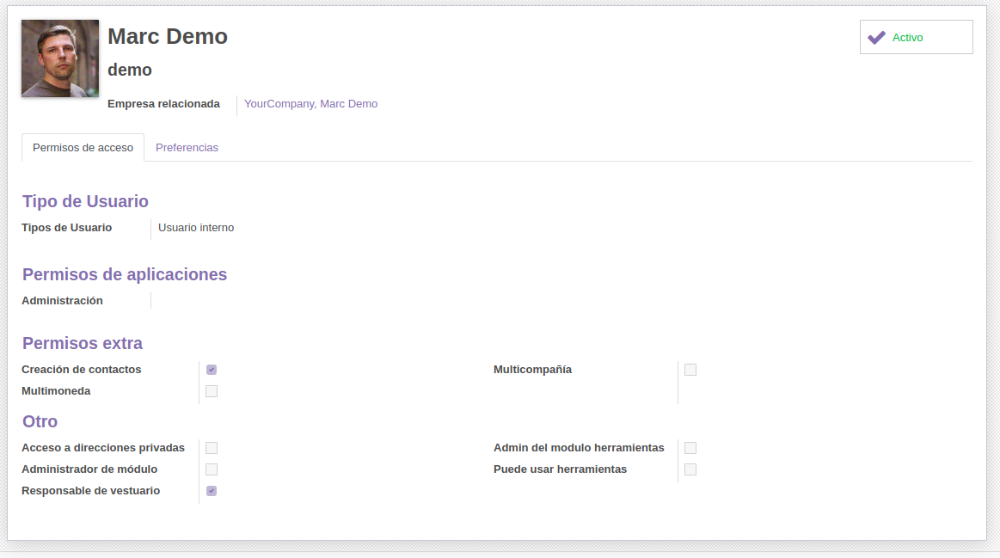

## MÓDULO DE GESTIÓN DE UNA ASOCIACIÓN CULTURAL

### Objectivo del módulo

El objectivo de este módulo es el manejo y control de diferentes aspectos de la gestión de una Asociación Cultural, como puede ser el vestuario propiedad de la asociación que se presta a los alumnos para las actuaciones, separado por categorías y en el que también podemos guardar datos de las modistas que nos confeccionan o arreglan las prendas.
Además, este módulo tiene un apartado para el control de la escuela, en la que se incluyen los cursos que se hacen, los profesores y los alumnos que asisten.
Los modelos del módulo estan separados en dos menús: menú vestuario y menú escuela.

### Funcionalidad y uso

En este apartado explicaremos la funcionalidad y uso de cada modelo del módulo.

Al desplegar el menú **Vestuario**, podemos acceder a los modelos **Vestuario**, **Categorías** y **Modistas**:

- **Vestuario**: sirve para tener un registro de todas las prendas del vestuario. Además se pude señalar por acciones si una prenda está 'prestada', 'en almacén' o 'en la modista'. Estas acciones tienen restricciones: una prenda no puede pasar de 'prestada' a 'en la modista' sin pasar por el almacén, y viceversa.
Por cada prenda se guarda su talla, la categoría a la que pertenece, el último usuario que prestó la prenda, la fecha y hora del último uso, y la modista que confeccionó esa prenda.

- **Categorías**: el este modelo se guardan las distintas categorías en las que se divide el vestuario de la asociación. La característica más señalable es que una categoría puede tener una categoría padre y subcategorías.

- **Modistas**: aquí se pueden guardar las modistas que realizan trabajos para la asociación. Para cada modista se guarda su nombre, su teléfono, su dirección y su especialización. La especialización guarda la categoría de vestuario en la que está especializada la modista. 

Al desplegar el menú **Escuela** podemos acceder a los modelos **Cursos**, **Alumnos** y **Profesores**:

- **Cursos**: el este modelo se guardan los cursos que se imparten en la escuela. En este modelo se guarda el nombre del curso, una descripción, el profesor que imparte el curso y una lista de alumnos que asisten a este curso. Además, tiene un campo calculado que sirve como contador, cuenta los alumnos que hai inscritos a este curso.

- **Alumnos**: se utiliza para guardar los alumnos de la escuela. Tiene una relación Many2many con Cursos, es decir, un alumno puede asistir a muchos cursos y un curso puede tener muchos alumnos, de tal forma que en alumnos existe una lista Cursos en la que figura los cursos a los que el alumno está inscrito, donde se pueden agregar y quitar cursos. Lo mismo pasa en cursos, que tiene la lista alumnos en la que se puede añadir alumnos.
Además, en alumnos se guardan los datos personales, como el nombre, la dirección, la talla y el teléfono.

- **Profesores**: el lugar donde se guarda la información de los profesores que imparten cursos en la escuela. Los datos recogidos son: el nombre, la dirección, el teléfono y una lista (visualizada con tags) de los cursos que imparte.

### Seguridad

Existen dos grupos de acceso al módulo: **Responsable de vestuario** y **Administrador de módulo**. 
El **Administrador del módulo** tiene acceso a todos los modelos del módulo, mientras que el **Responsable de vestuario** tiene acceso al menú de Vestuario.

